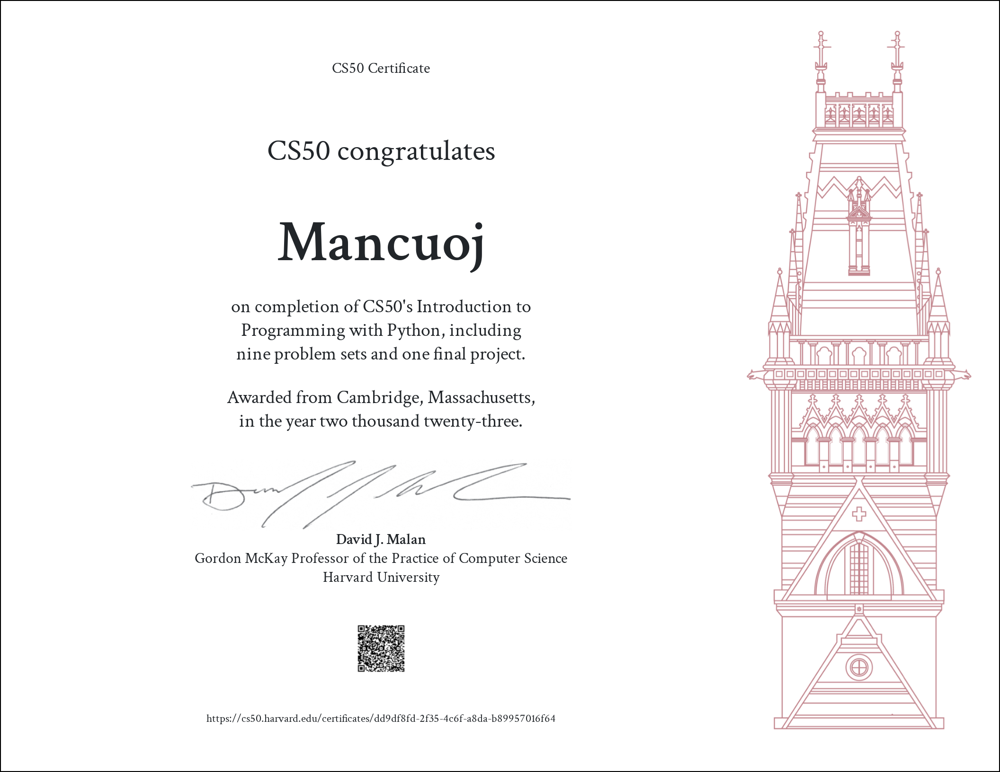

 

<h1 align="center">
Harvard CS50 Python — 2022
</h1>

  <a href="https://cs50.harvard.edu/python">Course Link</a> |
  <a href="https://github.com/mancuoj/CS50x">CS50x</a>

## Works

<pre align="center">
For Reference Only
</pre>

Spent five days of my free time to quickly finish it, and completed all the assignments. The next stop is still [CS61A](https://github.com/mancuoj/CS61A).

